---
# You can also start simply with 'default'
theme: seriph
# random image from a curated Unsplash collection by Anthony
# like them? see https://unsplash.com/collections/94734566/slidev
background: https://cover.sli.dev
# some information about your slides (markdown enabled)
title: Resolución desafío 1
info: |
  ## Slidev Starter Template
  Presentation slides for developers.

  Learn more at [Sli.dev](https://sli.dev)
# apply unocss classes to the current slide
class: text-center
# https://sli.dev/features/drawing
drawings:
  persist: false
# slide transition: https://sli.dev/guide/animations.html#slide-transitions
transition: slide-left
# enable MDC Syntax: https://sli.dev/features/mdc
mdc: true
# open graph
seoMeta:
  # By default, Slidev will use ./og-image.png if it exists,
  # or generate one from the first slide if not found.
  ogImage: auto
  # ogImage: https://cover.sli.dev
---

# Resolución desafío 1

Intro-Presentar

Club Informático Chile 🇨🇱

<div class="abs-br m-6 text-xl">
  <a href="https://github.com/Club-Informatico/Intro-presentar" target="_blank" class="slidev-icon-btn">
    <carbon:logo-github />
  </a>
</div>

<!--
The last comment block of each slide will be treated as slide notes. It will be visible and editable in Presenter Mode along with the slide. [Read more in the docs](https://sli.dev/guide/syntax.html#notes)
-->
---
transition: fade-out
layout: center
---
# Índice

<Toc text-sm minDepth="1" maxDepth="2" />

<style>
h1 {
  background-color: #2B90B6;
  background-image: linear-gradient(45deg, #4EC5D4 10%, #146b8c 20%);
  background-size: 100%;
  -webkit-background-clip: text;
  -moz-background-clip: text;
  -webkit-text-fill-color: transparent;
  -moz-text-fill-color: transparent;
}
</style>

---
transition: fade-out
---

# Desafío 1

El objetivo de este desafío es lograr realizar un fork desde el repositorio **Club Informático**. En el cual se tiene que editar el archivo **index.html** para presentarse. Posterior a eso hay que realizar un **Pull Request** y esperar el proceso de revisión. Si todo ha salido de manera satisfactoria. Se realizará un merge y se desplegará en la [web](https://club-informatico.github.io/Intro-presentar/) 

1. Tener configurado **Git** en la maquina local.
2. Tener un **editor de código**.
3. Tener una **cuenta de Github** creada.
4. Tener agregada la función **ssh** en Github.
<br>
<br>

<style>
h1 {
  background-color: #2B90B6;
  background-image: linear-gradient(45deg, #4EC5D4 10%, #146b8c 20%);
  background-size: 100%;
  -webkit-background-clip: text;
  -moz-background-clip: text;
  -webkit-text-fill-color: transparent;
  -moz-text-fill-color: transparent;
}
</style>

---
transition: fade-out
layout: center
---

# ¿Qué es Git?

**Git** es un **sistema de control de versiones distribuido**. Eso significa que es una herramienta que permite a programadores (y a cualquier persona que trabaje con archivos) llevar un historial de cambios, colaborar con otros y gestionar versiones de un proyecto.

<br>
<br>

<style>
h1 {
  background-color: #2B90B6;
  background-image: linear-gradient(45deg, #4EC5D4 10%, #146b8c 20%);
  background-size: 100%;
  -webkit-background-clip: text;
  -moz-background-clip: text;
  -webkit-text-fill-color: transparent;
  -moz-text-fill-color: transparent;
}
</style>


---
transition: fade-out
layout: center
---

# ¿Qué es GitHub?

**GitHub** es una **plataforma en la nube** que permite almacenar y compartir proyectos que usan **Git** como sistema de control de versiones.
Es como una red social para programadores y equipos de desarrollo: además de guardar el código, permite colaborar, revisar cambios y trabajar juntos en proyectos de software.

<br>
<br>

<style>
h1 {
  background-color: #2B90B6;
  background-image: linear-gradient(45deg, #4EC5D4 10%, #146b8c 20%);
  background-size: 100%;
  -webkit-background-clip: text;
  -moz-background-clip: text;
  -webkit-text-fill-color: transparent;
  -moz-text-fill-color: transparent;
}
</style>

---
transition: fade-out
layout: center
---

# 🛠️ Requisitos previos

1. Tener una cuenta en **GitHub**  
2. Configurar GitHub en tu computador  
   - `git config --global user.name`  
   - `git config --global user.email`  
3. Generar y registrar tu **SSH key** en GitHub  

---
transition: fade-out
---

# Paso 1: Hacer un Fork

Repositorio base:

👉 <https://github.com/Club-Informatico/Intro-presentar>

1. Click en **Fork**  
2. Se crea tu copia en tu cuenta de GitHub  

<br>

# 💻 Paso 2: Clonar el Fork

```bash
git clone git@github.com:TU_USUARIO/Intro-presentar.git
cd Intro-presentar
````

<br>

# ✍️ Paso 3: Editar el archivo

* Agregar tus datos en el archivo indicado
* Guardar los cambios

---
transition: fade-out
---

# 📌 Paso 4: Git Add & Commit

```bash
git add .
git commit -m "Agrego mi presentación"
```

<br>

# 📤 Paso 5: Push al Fork

```bash
git push origin main
```

<br>

# 🔀 Paso 6: Pull Request (PR)

* Ir a tu repositorio en GitHub
* Click en **Compare & pull request**
* Crear el PR hacia `Club-Informatico/Intro-presentar`

---
transition: fade-out
layout: center
---

# ✅ Revisión y Aprobación

* El PR será revisado
* Si está correcto → **Se aprueba y se hace merge**


---
transition: fade-out
---

# ⚙️ GitHub Actions

* Al aprobar el PR → Se activa un **GitHub Action**
* Workflow automático:

  1. Compila el proyecto
  2. Genera los archivos estáticos

<br>

# 🌐 GitHub Pages

* Los archivos se publican automáticamente en **GitHub Pages**
* Tu presentación queda disponible en línea 🎉

---
transition: fade-out
---

# 🔄 Resumen del flujo

```mermaid
flowchart LR
    A[Tu Fork] -->|commit & push| B[Pull Request]
    B --> C[Revisión]
    C -->|merge| D[GitHub Actions]
    D --> E[GitHub Pages]
```




---
transition: fade-out
layout: center
---

# Comandos utilizados

```bash
git status
# Sirve para verificar si los archivos estan en el Staging Area
```

<br>

```bash
git add index.html
# Agrega los archivos al Stagin Area
```
<br>

```bash
git commit -m "Presentación Carlos Carrasco"
# Guarda en el historial y agrega un comentario
```
<br>

```bash
git push origin main
# Realiza la sincronización con nuestro Github
```

<style>
h1 {
  background-color: #2B90B6;
  background-image: linear-gradient(45deg, #4EC5D4 10%, #146b8c 20%);
  background-size: 100%;
  -webkit-background-clip: text;
  -moz-background-clip: text;
  -webkit-text-fill-color: transparent;
  -moz-text-fill-color: transparent;
}
</style>

---
transition: fade-out
layout: center
---

# 🙌 Conclusión

Con este desafío aprendiste:

  ✅ GitHub básico

  ✅ Pull Requests

  ✅ GitHub Actions

  ✅ GitHub Pages

¡Felicidades por completar el reto! 🎉

---
transition: fade-out
layout: center
---

# Fin de la presentación

<PoweredBySlidev mt-10 />

<style>
h1 {
  background-color: #2B90B6;
  background-image: linear-gradient(45deg, #4EC5D4 10%, #146b8c 20%);
  background-size: 100%;
  -webkit-background-clip: text;
  -moz-background-clip: text;
  -webkit-text-fill-color: transparent;
  -moz-text-fill-color: transparent;
}
</style>
